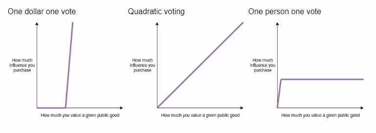

# Vote Pray Love

Polkadot Blockchain Academy 2022 Cohort Final Exam Project.

## Summary
This is a pallet quadratic voting pallet based off substrate [collective pallet](https://marketplace.substrate.io/pallets/pallet-collective/).
The additional feature is the slashing mechanism which provides an incentive for voters to collaborate in the decision making process.

**NOTE**: *This is an experimental pallet, no research has not conducted to actually prove economic costs of this governance system.*

## Idea

The idea behind is to introduce the quadratic voting, make it anonymous and slash-reward the voters. Let's break it down.
* Any account with identity can join a voting council to be a part of governance
* When the user joins the council, fixed amount of voting tokens is allocated the account
* The user must reserve some currency to have skin in a game
* When the proposal is created, the length in blocks is specified
* The voters submits votes anonymously. The votes are measured on a quadratic scale
* When the voting is over, the reveal phase begins
* Voters have limited time to reveal their actual votes
* Votes are calculated and the result is deduced
* If the voter is in minority (i.e. on the losing side). 10% of their stake is slashed and deposited to the *"pot"*
* If the voter is in majority, they receive even proportion of the reward from the *"pot"*
* If the vote is a tie, both parties get slashed and the money go to proposer
* Once the voter has finished all proposal, they can leave the organisation and *cash out*

## Motivation
The classical voting system has very little incentive for voters. The average vote turn-up does not exceed 10%. These ratio can not provide the true representation of opinion of the population. Therefore, the additional incentive has to be provided. I was interested in running this sort of system as a game theory experiment to see
how voters behave under such incentive.

Anonymous voting ensures that voters make choice motivated by personal choice and rationally and not profit-seeking.
The slashing ans reward system incentives voters to actually participate in the voting process while quadratic voting system has benefits of allowing voters to express strong preference of their choice. Quadratic voting has a linear dependency and not tied to the economic influence of particular entity.

Different solution for anonymous voting have been considered. Here is the summary of the main two:

### Shared public key

1. Author creates a proposal and generates a keypair for this proposal
2. The public key of the proposer is distributed to voters
3. Voters encrypt their vote using the public key and sign transaction with their private key
4. Once timeout and enough votes are collected, the proposer is ready to reveal the results
5. The proposer uses their private key to decrypt votes and calculate the outcome of vote

If the proposer reveals results before the timeout -> slashing
If the proposer tries to inside-trade the intermediate vote results -> no solution, might be worth using nominating random voters
to generate keypairs and use multi-sigs to collectively reveal the results

### Commit and Reveal
1. Author publishes a proposal
2. The voters commit their decision
3. Once timeout is out, the voters have some time to reveal their choices
4. If the voters does not reveal their results -> slashing

While the first approach may seem more convenient for the voter since they only need to submit a single transaction to represent a vote, it harm the global integrity of a governance protocol. The voter can simply inside-trade the actual votes and give away votes of other voters before the end of voting phase. The *commit and reveal* approach ensures trustlessness of a solution, hence, a suitable solution.

While it may seem a burden for user and proposer, the economic incentive actually motivates any voter to end the *commit* phase and *reveal* phase ASAP to potentially collect reward from voting.

## Objectives
A summary of what has been implemented and what's planned:
- [x] Basic quadratic voting system
- [x] Anonymous quadratic system (commit-reveal)
- [x] Staking
- [x] Slashing
- [x] Caching-out
- [x] Docs
- [ ] Tests & Mocks

## Running
Simply run script `build-run.sh` script to build a chain in release mode and run a dev node.
Otherwise, `/scripts` contains additional scripts to run your chain in docker.

Refer to [substrate setup instructions](docs/substrate-setup.md) to start hacking

### Account commit signatures for voting
* Alice - Yes - salt: `10` - `f26b35c9565f76a01b06ac1dd80832027a59306de8ac31b1019dff75890ec76c3376fb11985323f75788750a9c9ec0e17fc26440a49914d00ff2b7ef2d1a588f`
* Bob - No - salt: `10` - `b67cec01fabdc17233dc1080f09c4ffb86d0f19077f6c4f601f951a7f5a851175d127bb64142a24074596e2496388a9f01b00cd3a9db21a458e76757deda8585`

[Gist for generating signatures](https://gist.github.com/SkymanOne/b74096c4845e0af69b17fefb25eabf92)

## Resources

[Quadratic voting](https://www.economist.com/interactive/2021/12/18/quadratic-voting)
[Commit - reveal](https://karl.tech/learning-solidity-part-2-voting/)
